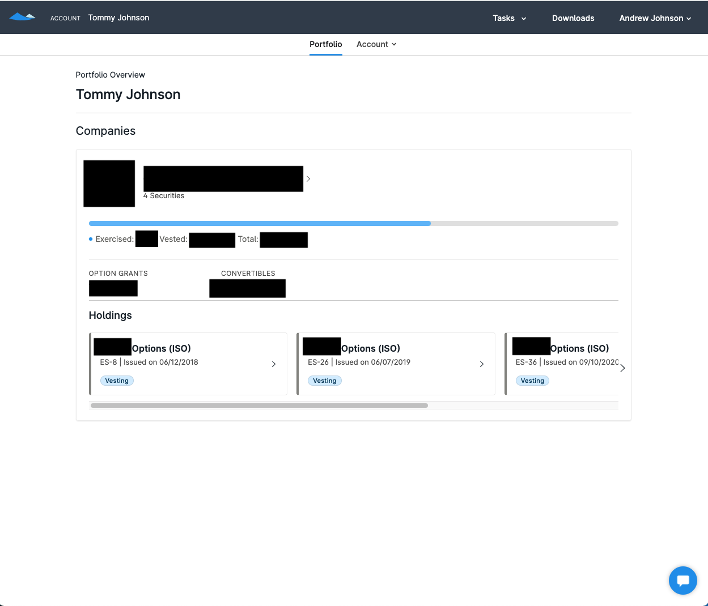
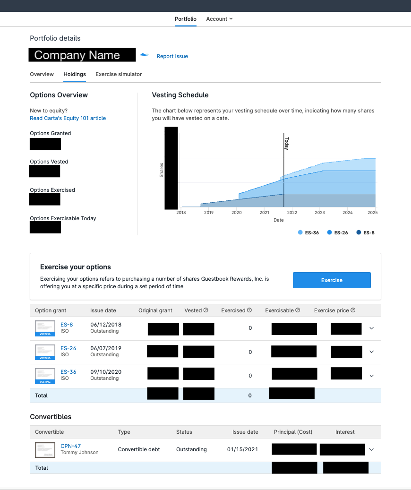

# PsyOptions Portfolio Manager

Options. Simplified. 

The [Psy American protocol](https://docs.psyoptions.io/american-v1/how-it-works) is an 
extremely flexible primitive for writing, exercising, or closing physically settled 
American style option positions. Phyiscally settled American style option contracts can 
be used for all kinds of things outside of just trading. This is because the option contract
allows variable levels of 
[intrinsic value](https://www.investopedia.com/terms/i/intrinsicvalue.asp) and upside 
to be granted to the holder. Some examples of other uses outside of a market:
* Long tenor calls can reward contributors (Could be viewed as similar to ISOs)
* Calls airdropped to community members
* Long tenor calls for liquidity mining (Options Liquidity Mining)

With these examples in mind, there is a different kind of persona that would be 
receiving them. Many of these receipients may be confused by a complex trading 
interface. 

## V1
The goal of the initial release is to display a user's (known) held options and
provide simple insight and recommendation to those options. It requires two core 
pages:
1. Portfolio overview page
    * When the user has no wallet connected:
        1. Ask the user to connect their wallet
    * When the user connects their wallet:
        1. Load and display all projects (from project list JSON) that the user holds 
        some options. The display should be a simple box with the project name, then 
        a scrollable list of cards with the various options held. See Portfolio Overview 
        example from Carta below. Note that Carta has many more features and data points
        than we do from the chain. (E.g. currently no historical data about exercising). 
2. Project holdings page
    * To get here the user must click on one of the projects in their index page.
    * On this page we should again display the various options in the wallet for the 
    project and the data about those options (e.g. strike, expiration, etc). There should be a Call To Action on each option that says Exercise.
    * The top of the page should display the price of the underlying token (the 
    project's tokne), taken from the Serum market address (or the Aleph API).
    * Based on the price of the underlying the UI should give insight to the user
    on whether it makes sense or not for them to exercise a given option contract
    and what exchange must be made for that to happen.
    * See the Project Holdings Screenshot for an example from Carta. Again Carta has
    access to a lot more data so this is just for reference.



Portfolio Overview Screenshot



Project Holdings Screenshot

## Add Project Data

Project data is stored in this open repo as JSON.

Add content via pull-request here:

```
/src/content/projectList.json
```

## Development

### Install


`
git clone git@github.com:mithraiclabs/psyoptions-management.git
`

`
yarn install
`

### Run

`
yarn start
`

### DevTools

The project uses recoil and some experimental dev tools.

`src/components/DevTools`

In the browser, you can use these commands:

- changeMonitorKey `ctrl-m`
- changePositionKey `ctrl-q`
- toggleVisibilityKey `ctrl-h`

The console and dock monitor will update after recoil state changes
